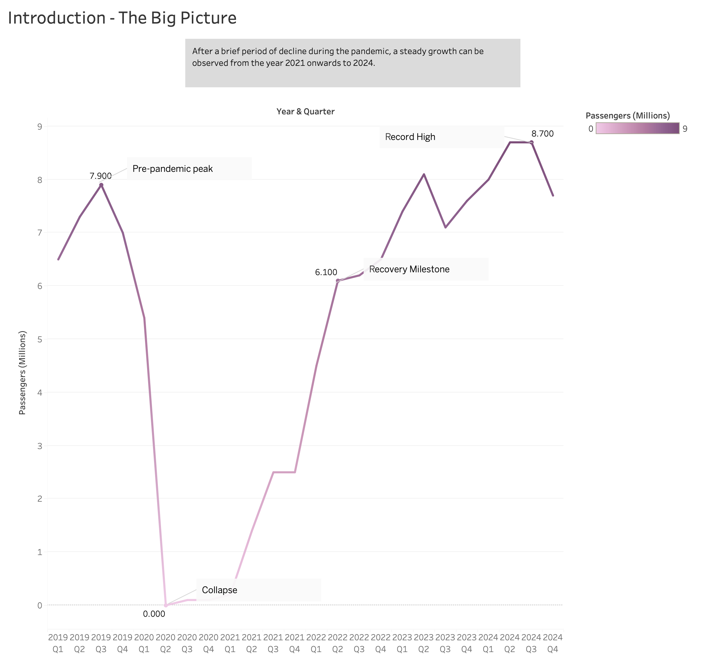
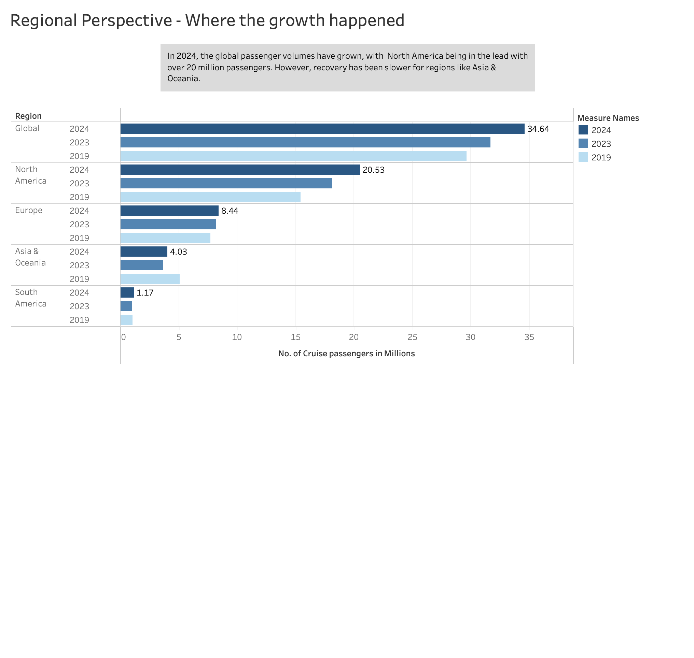
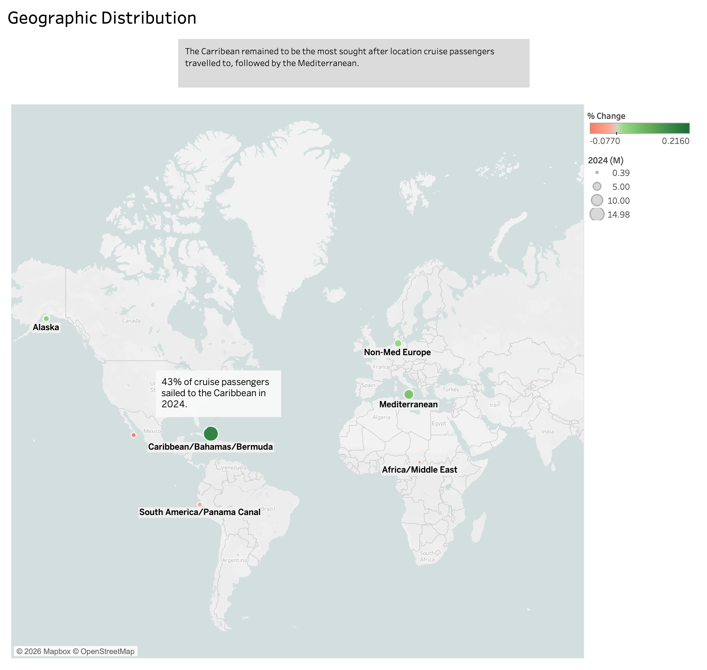
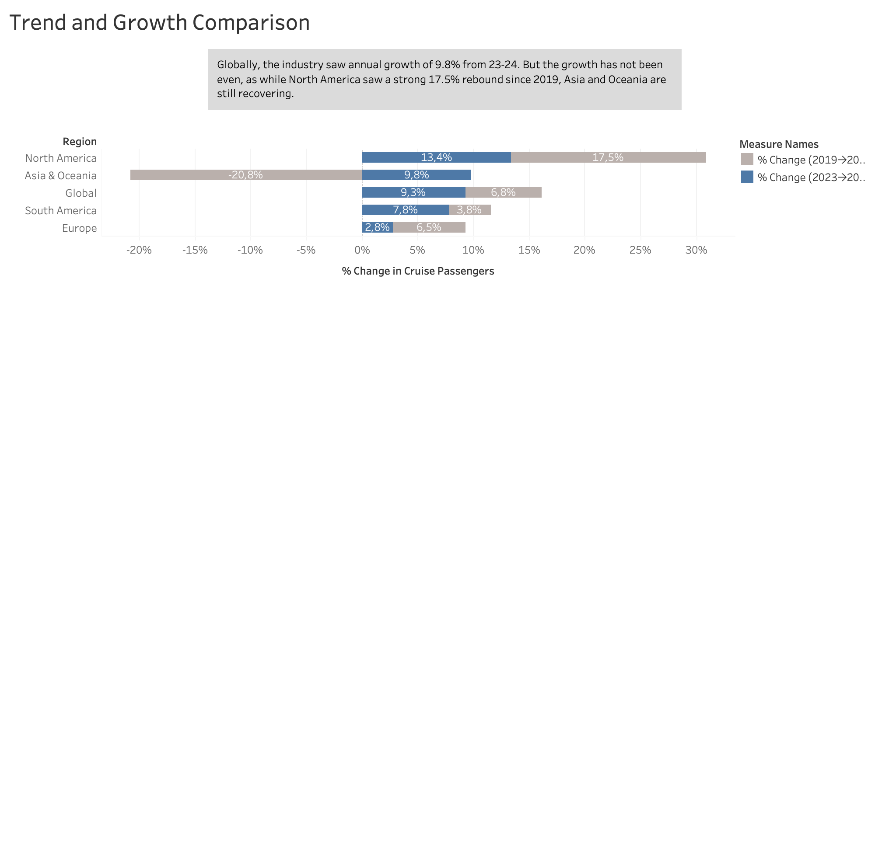
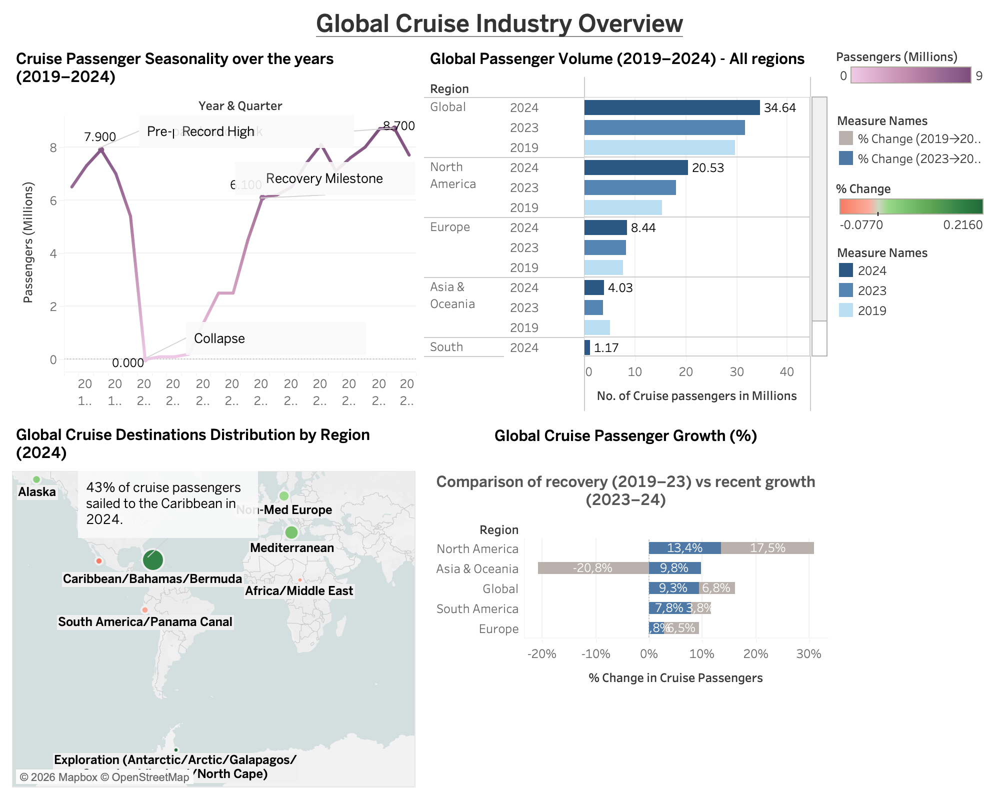

# 🚢 Global Cruise Industry Analysis

A data story built in Tableau exploring the global cruise industry's recovery, regional growth patterns, and destination trends using data from the **CLIA State of the Cruise Industry Report 2025**.

---

## 📖 Project Overview

The cruise industry experienced one of the most dramatic collapses and recoveries of any global sector — dropping to near zero in 2020 and reaching a record high of 8.7 million passengers per quarter by 2024. This project visualises that journey through a structured 4-part Tableau Story, examining global trends, regional disparities, geographic distribution, and growth comparisons.

---

## 📊 Tableau Story — 4 Parts

### Story 1 — Introduction: The Big Picture
A quarterly line chart tracking cruise passenger volumes from 2019 through 2024, with annotated milestones marking the pre-pandemic peak, collapse, recovery, and record high.

> *"After a brief period of decline during the pandemic, a steady growth can be observed from the year 2021 onwards to 2024."*

---

### Story 2 — Regional Perspective: Where the Growth Happened
A grouped horizontal bar chart comparing passenger volumes across global regions in 2019, 2023, and 2024 — showing North America's dominance and Asia & Oceania's slower recovery.

> *"In 2024, global passenger volumes have grown, with North America being in the lead with over 20 million passengers. However, recovery has been slower for regions like Asia & Oceania."*

---

### Story 3 — Geographic Distribution
An interactive bubble map showing the top cruise destinations in 2024, with bubble size encoding passenger volume and colour encoding year-on-year % change.

> *"The Caribbean remained the most sought-after location cruise passengers travelled to, followed by the Mediterranean."*

---

### Story 4 — Trend and Growth Comparison
A diverging bar chart comparing two growth periods — the post-COVID recovery (2019→2023) and recent growth (2023→2024) — across all source regions, revealing uneven recovery patterns globally.

> *"Globally, the industry saw annual growth of 9.8% from 2023–24. But the growth has not been even — while North America saw a strong 17.5% rebound since 2019, Asia and Oceania are still recovering."*

---

### Dashboard — Global Cruise Industry Overview
A consolidated single-view dashboard combining the seasonality line chart, regional passenger volume comparison, geographic destination map, and growth comparison chart for an at-a-glance overview of the industry.

---

## 🔍 Key Insights

- Global cruise passengers reached a **record 34.64 million in 2024**, surpassing pre-pandemic levels
- **North America dominates** with 20.53 million passengers — nearly 60% of global volume
- **Asia & Oceania** is the only region still below 2019 passenger levels, down 20.8% since pre-COVID
- **The Caribbean attracted 43%** of all cruise passengers in 2024, remaining the world's top cruise destination
- Q3 is consistently the strongest sailing quarter across all years — a structural seasonal pattern

---

## 🛠 Tools Used

- **Tableau Desktop** — data visualisation and story building
- **Microsoft Excel** — data preparation and structuring

---

## 📁 Data Source

CLIA State of the Cruise Industry Report 2025 — publicly available at [cruising.org](https://cruising.org)

*Data includes global passenger volumes, regional breakdowns, destination statistics, and quarterly trends from 2019 through 2024.*

---

## 👩‍💻 Author

**Haniyah Saleem**
MS Business Analytics, Qatar University
[LinkedIn](https://www.linkedin.com/in/haniyah-saleem/) · [haniyahsaleem05@gmail.com](mailto:haniyahsaleem05@gmail.com)
